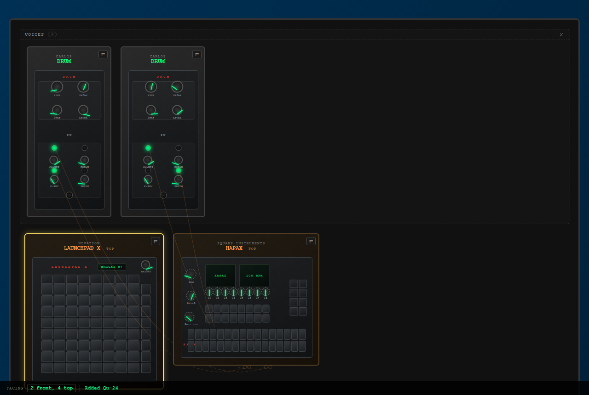

# 05 — In the browser

> **Runtime-bound: a server and a browser.** This page starts the real
> application on a port of its own and drives it in real Chromium. It does not
> skip when either is missing — it fails. A skip is not a pass, and a
> demonstration nobody can run is a claim.

Everything before this page asserts the model. This one asserts the screen, and
the pictures below it are byproducts of the same run: **taken from the render
those assertions were made against, recorded and never compared.** A test that
diffs images fails on a font and gets switched off, taking the assertions
sitting beside it. The regression protection is the assertions.

## Provisioning

```python
>>> from walkthrough.support import LiveApp, Shots, chromium, open_rack, release
>>> from walkthrough.support import bare_rack, open_menu, pick, until
>>> app = LiveApp().start()
>>> shots = Shots('05-in-the-browser')
>>> browser = chromium()

```

`LiveApp.start()` polls `/healthz` and raises `Unreachable` if it never
answers. A port of its own, not 8000: a developer's own server is usually up,
and measuring that one would test whatever code happened to be running.

Both the server and the browser register their own shutdown as they start.
doctest stops at the first failing example, so a page that dies half way
through never reaches the teardown at the bottom of it — and a server that
outlives its run holds a port until somebody notices. One session left seven of
them.

## The bare port lands on the splash

Opening a rack is a thing you choose. Arriving at the address gets you a page
that says what this is and one way in:

```python
>>> landing = browser.new_page()
>>> _ = landing.goto(app.base, wait_until='networkidle')
>>> landing.url.endswith('/splash')
True
>>> landing.inner_text('.splash-name')
'CARLOS'

```

Its figures are measured rather than typed, so a device added to the catalogue
is a device the splash counts:

```python
>>> from src import catalogue
>>> str(len(catalogue.load_all())) in landing.inner_text('.splash-facts')
True

```

The way in is a link, so it works before any JavaScript does:

```python
>>> landing.get_attribute('.splash-enter', 'href')
'/rack'
>>> landing.close()

```

## Boot

```python
>>> page = open_rack(app, browser)
>>> page.title()
'Carlos - Synth Patch Workspace'

```

The catalogue is fetched at startup, and the rack opens on a rig rather than on
a demonstration: every device this build knows about, in three rows, patched the
way they would be on a desk — control into voices, voices into the desk, desk
into the interface.

```python
>>> page.locator('.module').count()
11
>>> page.locator('.rack-group-label').all_text_contents()
['Control', 'Voices', 'Out']

```

It is **fetched, not built**. `catalogue/opening.json` is an ordinary patch
document served from `/api/opening`, so the first thing anyone sees is a file
they can export, edit and import again. It used to be two `addModule` calls in
the frontend, which made the opening picture the one part of the app nobody
could copy.

```python
>>> import json, urllib.request
>>> with urllib.request.urlopen(f'{app.base}/api/opening') as response:
...     document = json.load(response)
>>> document['format'], len(document['modules']), len(document['connections'])
('carlos.patch', 11, 17)

```

Seventeen leads, and the picture is drawn from them rather than from a count:

```python
>>> page.locator('path.cable').evaluate_all(
...     'paths => new Set(paths.map(p => p.dataset.cable)).size')
17

```

The grid and the sampler are both played from above and both have their USB
round the back, so that lead runs to the silhouette of each device rather than
to a socket you cannot see.
It is dashed for the part of its run that is behind something — which is true
of every USB lead on every desk.

And it is drawn *behind* the gear, on a second cable layer under the devices.
There are two layers because a rack has a front and a back: a lead across a
front panel runs over the gear, and one going round the back does not. Which
layer a lead lands on is read off its geometry every redraw, so turning a device
away moves its lead under.

A lead does not have to pick one layer. When one end is on a face you can see
and the other is round the back, it is cut in half at the middle: the half
leaving the visible socket is drawn in front and solid, the half arriving behind
the other device is drawn under it and dashed. Drawing all of it either way is
wrong at one end — entirely in front and it lies across the device it disappears
into, entirely behind and it vanishes at the socket it is plugged into. The two
halves are quadratics from one de Casteljau split, so they meet exactly.

Three positive numbers in one order — lower layer 1, devices 2, upper layer 5 —
and the first attempt at this used `z-index: -1` on the layer instead, which
made every dashed lead **vanish**. A negative child paints above its *stacking
context's* background, and the rack is `position: relative` with `z-index: auto`,
which does not create one; the cables went behind the rack's own opaque floor.
Lifting the gear has no such trap.

```python
>>> usb = 'path.cable[data-cable="grid:usb->sampler:usb_c"]'
>>> page.locator(f'#patch-cables-behind {usb}').count()
4
>>> page.locator(f'#patch-cables {usb}').count()
0

```

The mark showing where a lead disappears stays on the front layer, because a
mark you cannot see marks nothing:

```python
>>> page.locator('#patch-cables .cable-anchor').count() > 0
True

```

```python
>>> page.locator('path.cable').count() > 0
True
>>> 'is-occluded' in page.locator('path.cable').first.get_attribute('class')
True

```

One lead, four channels. Three melodic groups on 1 to 3 and the kit on 10, so
the cable is drawn as four strands: the picture answers "which group is that
going to" without anything being clicked.

```python
>>> strands = page.locator(usb)
>>> sorted(strands.evaluate_all(
...     'paths => paths.map(p => Number(p.dataset.channel))'))
[1, 2, 3, 10]

```

It is not the only one. The keyboard runs into the sequencer on two tracks, so
that lead is drawn as two — the split is a property of a lead, not something
this rig does once:

```python
>>> keys = 'path.cable[data-cable="keys:midi_out->seq:midi_a_in"]'
>>> sorted(page.locator(keys).evaluate_all(
...     'paths => paths.map(p => Number(p.dataset.channel))'))
[5, 6]

```

Each strand is tinted by where it sits along the run, so telling them apart does
not need a hover. The strand carries a **position**; the scale itself lives in
the stylesheet with the rest of the palette, which is why no cable writes a
colour of its own:

```python
>>> sorted(strands.evaluate_all(
...     "paths => paths.map(p => p.style.getPropertyValue('--lane-mix'))"))
['0', '0.3333333333333333', '0.6666666666666666', '1']
>>> page.locator('path.cable').evaluate_all(
...     "paths => paths.filter(p => p.hasAttribute('stroke')).length")
0

```

Channel 10 is the drums, by a convention nothing enforces and everything obeys.
It is off the gradient rather than further along it — thicker, and its own
colour — because it is not a point on a scale, it is the strand you are looking
for:

```python
>>> drums = page.locator('path.cable.is-drums')
>>> drums.count(), drums.get_attribute('data-channel')
(1, '10')
>>> '(drums)' in drums.locator('title').text_content()
True

```

The split is **derived, not stored**. A MIDI binding says which messages belong
to which device; the channels bound to the device at the far end are the
channels on the cable. Rebinding a group redraws the strands, and nothing has to
be kept in step by hand — the same rule that keeps a knob's rotation and a
jack's side out of the document.

```python
>>> page.locator('path.cable[data-channel] title').first.text_content()
'Launchpad X USB-C (back) <-> EP-133 K.O. II USB-C (back) - through a host - channel 1: Group A'

```

The strands spread across the run rather than under it, and each whole cable
drifts a little either side of where gravity would put it — under as often as
over. That drift used only ever to *add* sag, so a bundle of leads leaned
downhill together instead of scattering.

Two USB device ports do not reach each other on a real desk: a computer or a
host adapter sits between them. The cable says so, because a rig sketch that
implies otherwise is a sketch you cannot build from.

**A browser JS error never reaches the server log.** The log is identical
whether the page works perfectly or throws on every keypress, which is why this
project could not previously claim the page worked at all. The console is
captured, and here it is:

```python
>>> page.errors
[]

```

## One menu, in two states

There is no floating panel. There was, and it held what a ring supposedly could
not — but a panel is a second menu surface, and rad's contract settles that
there is one. A ring you leave open over the rack *is* what it was.

`View ▸ Pin ring` leaves it up. Pinned, it does not close when it has done
something: it returns to its root and stays, because the next thing you want is
usually also on it.

```python
>>> spot = bare_rack(page)
>>> open_menu(page, *spot)
>>> pick(page, 'View')
>>> pick(page, 'Pin ring')
>>> _ = page.wait_for_selector('.rad-layer.is-pinned', timeout=5000)
>>> page.locator('.rad-wedge').count()
7

```

Its idle hub reads the rack — asked at render time rather than pushed, so the
ring holds no copy of a rack that goes on changing underneath it:

```python
>>> hub = ' '.join(
...     page.locator('#rad-menu-title tspan').all_text_contents()).strip()
>>> '11 devices' in hub, '17 leads' in hub, '3 rows' in hub
(True, True, True)

```

It survives being used, which is the whole point — a ring that vanished after
every commit would be a panel that closed itself whenever you touched it:

```python
>>> pick(page, 'View')
>>> pick(page, 'Minimal')
>>> until(page, "document.querySelector('#status').textContent"
...             ".includes('minimally')")
>>> page.locator('.rad-wedge').count()
7
>>> pick(page, 'View')
>>> pick(page, 'Unpin ring')
>>> until(page, "document.querySelector('#status').textContent"
...             ".includes('let go')")
>>> page.locator('.rad-wedge').count()
0

```

The hub is drawn larger when pinned, and **only drawn** larger: the dead zone
the machine cancels inside is the contract's `r0` and stays `r0`, so the gesture
is identical either way.

What is left at the foot of the window is a dock, and a dock is not a menu — a
status line and the facing indicator, the two things a ring cannot hold because
they change on their own:

```python
>>> page.locator('#tool-palette').count()
0
>>> page.locator('#dock').is_visible()
True

```

And the facing indicator reports the rack it is actually looking at. A mixed
rack says so rather than picking a winner:

```python
>>> page.locator('#view-indicator').inner_text()
'6 front, 5 top'

```

> That assertion is why this page exists. It read `EMPTY` on a rack with two
> devices in it, for two sessions, because nothing refreshed it when a device
> was added — and every model-level test agreed with the model. The first run
> of this page found it.

```python
>>> shots.take(page, 'boot')
'05-in-the-browser-boot.png'

```


## The menu is a ring

Right-click on bare rack — a point found by asking the page what is under it,
rather than computing a corner and hoping nothing is in it.
The ring holds at most eight, which the resolver enforces rather than a
reviewer — and the rack's own ring is six. Six permanent families, every one of
which opens something:

```python
>>> spot = bare_rack(page)
>>> open_menu(page, *spot)
>>> page.locator('.rad-wedge').count()
7
>>> [text.rstrip(' ▸') for text
...  in page.locator('.rad-label').all_text_contents()]
['Add', 'Rows', 'View', 'Patch', 'MIDI', 'All Devices', 'Edit']

```

Six families and the door you arrange them through. `Edit ▸` moves a family
round the ring, hides one you never use, and puts it all back — and a ring
nobody has edited resolves exactly as it ships, so it costs nothing to anyone
who never opens it.

Every one carries `▸`, the mark rad-android puts on a wedge that opens a ring
rather than committing — so "all six are families" is visible rather than
something you find out by trying. The hub reads the full name of whichever wedge
you are pointing at, which is what lets a wedge be short: it is the one place on
the ring a whole word is ever spelled out.

```python
>>> hub = lambda: ' '.join(
...     page.locator('#rad-menu-title tspan').all_text_contents()).strip()
>>> hub()
'Rack'

```

It used to be eight items of two kinds: four families that opened submenus and
four actions that fired, and which was which you learned by trying. Six rather
than eight because the ceiling is eight — a ring at the ceiling has nowhere to
grow, and the next good idea would have to displace one of these rather than
join it.

```python
>>> shots.take(page, 'menu')
'05-in-the-browser-menu.png'

```


`pick` moves the real pointer onto a wedge and releases, which is the gesture —
the menu resolves a position into a wedge and knows nothing about which element
was under the cursor.

```python
>>> pick(page, 'Patch')
>>> pick(page, 'Examples')
>>> page.locator('.rad-wedge').count()
8

```

Eight categories, one ring. Devices are grouped by category and the overflow
would become a continuation submenu rather than a ninth wedge.

## Loading the drum rig

```python
>>> pick(page, 'controller')
>>> pick(page, 'Launchpad X')
>>> until(page, "document.querySelector('#status').textContent.includes('Imported')")
>>> page.locator('#status').inner_text()
'Imported "A grid playing a modular drum rig": 4 module(s), 4 cable(s), 1 group(s)'

```

Four devices, four cables, and the example asked for `irl`, so the rack is
drawn as laid out:

```python
>>> page.locator('body').get_attribute('data-display-mode')
'irl'

```

Counted as leads rather than as paths, because each of these has one end round
the back: a lead whose two ends are in different places in the room is drawn in
two halves on two layers, and every piece says which lead it belongs to.

```python
>>> page.locator('path.cable').evaluate_all(
...     'paths => new Set(paths.map(p => p.dataset.cable)).size')
4
>>> page.locator('path.cable').count()
8

```

## The panels are drawn

This is the claim two sessions of work could not check: that the panel
vocabulary renders as panels rather than as a row of grey boxes.

The Launchpad X's grid, and the Hapax's two pad blocks, are real elements with
real boxes:

```python
>>> page.locator('.irl-pads .irl-cell').count()
112

```

Sixty-four of them are the Launchpad's, and the modules are addressed by the
ids the example gave them:

```python
>>> launchpad = page.locator('[data-module-id="grid"]')
>>> launchpad.locator('.irl-pads .irl-cell').count()
64

```

A device draws the sides that carry something and lays out only the one it is
showing, so the panel to measure is the active face. A Launchpad X is 241mm square and the
face it opens on is its top — width by depth — so that panel is square too. That is the box doing its job: a
single per-device aspect would have drawn this face at 241 by 17.4.

```python
>>> panel = launchpad.locator('.face.active .irl-panel').bounding_box()
>>> round(panel['width'] / panel['height'], 1)
1.0

```

A device drawn as laid out is drawn near its real size relative to its
neighbours. A Launchpad X is 241mm across and a drum module is 40mm, so the
grid is the wider of the two on screen — by a compressed ratio, which is what
makes this a caricature rather than a scale drawing:

```python
>>> wide = launchpad.bounding_box()['width']
>>> narrow = page.locator('[data-module-id="kick"]').bounding_box()['width']
>>> wide > narrow
True
>>> 1 < wide / narrow < 6      # not to scale: really it is six times wider
True

```

```python
>>> shots.take(page, 'irl-drum-rig')
'05-in-the-browser-irl-drum-rig.png'

```


## Pressing a pad does something

The rig loaded above binds three pads to three drum voices on channel 10. The
grid on screen is not a picture of a grid: each cell is a button, and pressing
one sends a note down the same path a real MIDI port uses.

```python
>>> pads = launchpad.locator('.irl-pads button.irl-cell')
>>> pads.count()
64
>>> pads.first.get_attribute('title')
'note 36 ch 10'

```

Note 36 on channel 10 is what `kick` is bound to. Press it:

```python
>>> pads.first.click()
>>> until(page, "document.querySelector('#status').textContent.includes('note 36')")
>>> page.locator('#status').inner_text()
'Launchpad X: note 36 ch 10'

```

The binding matched, so the device it points at is lit — `is-active` is the
class the MIDI layer adds, and nothing here reached for it directly:

```python
>>> page.locator('[data-module-id="kick"]').get_attribute('class')
'module is-active'

```

That is the whole chain: a button in the browser, through the catalogue's
declared note, into `MidiInput`, matched against a binding, out to a device's
class. The drum voice that is *not* bound to that note stays dark:

```python
>>> page.locator('[data-module-id="clap"]').get_attribute('class')
'module'

```

A press is momentary, so the light goes out on its own:

```python
>>> until(page, '''!document.querySelector('[data-module-id="kick"]')
...                  .classList.contains('is-active')''')
>>> page.locator('[data-module-id="kick"]').get_attribute('class')
'module'

```

## Screens say what is happening

A screen shows what its catalogue entry says it reads. The Launchpad's reads
the last event, so it is showing the note that was just sent:

```python
>>> screen = launchpad.locator('.face.active .irl-screen')
>>> screen.get_attribute('data-source')
'last-event'
>>> screen.locator('.irl-screen-text').inner_text()
'NOTE 36 CH 10'

```

Move a control and the same screen follows, because moving a control is an
event too:

```python
>>> knob = launchpad.locator('.irl-knob').first
>>> knob.click()
>>> page.keyboard.press('ArrowUp')
>>> until(page, '''document.querySelector('.face.active .irl-screen .irl-screen-text')
...                  .textContent.startsWith('BRIGHT')''')
>>> screen.locator('.irl-screen-text').inner_text().startswith('BRIGHT')
True

```

## The two panels with the most on them

A keybed and a fader bank are the two things the vocabulary was extended for,
and neither is in the rig above. Add them the way anyone would:

```python
>>> open_menu(page, *spot)
>>> pick(page, 'Add')
>>> pick(page, 'keyboard')
>>> pick(page, 'Stage 3')
>>> open_menu(page, *spot)
>>> pick(page, 'Add')
>>> pick(page, 'mixer')
>>> pick(page, 'Qu-24')
>>> until(page, "document.querySelectorAll('.irl-key').length === 88")

```

An 88 is 52 naturals and 36 sharps, drawn from A. Any other split is a keybed
drawn from the wrong note, which puts the wrong key under every hand position:

```python
>>> keys = page.locator('.irl-key')
>>> (keys.count(), page.locator('.irl-key.is-sharp').count())
(88, 36)

```

A desk is its fader bank, and every one of the twenty-four channel faders moves
— plus the master. They were drawn as the shape of the device once; a desk you
cannot move a fader on is a photograph.

```python
>>> page.locator('.irl-fader:not(.irl-drawbar)').count()
25
>>> page.locator('.irl-fader[role="slider"]').count()
34

```

The organ's nine drawbars are faders too, and they are real controls — a
drawbar is a fader with a grip you can see, which is what tells an organ
section from a mixer strip at a glance:

```python
>>> page.locator('.irl-drawbar').count()
9
>>> page.locator('.irl-drawbar[role="slider"]').count()
9

```

Both devices are played from their tops, so that is the face each opens on:

```python
>>> for model in ('Stage 3', 'Qu-24'):
...     card = page.locator('.module').filter(has_text=model).first
...     print(model, '->', card.locator('.face.active').get_attribute('data-side'))
Stage 3 -> top
Qu-24 -> top

```

```python
>>> shots.take(page, 'keybed-and-desk')
'05-in-the-browser-keybed-and-desk.png'

```



## Turning a device

`t` turns the whole rack; the indicator follows what is actually showing.

```python
>>> page.keyboard.press('t')
>>> until(page, "document.querySelector('#view-indicator').textContent !== 'ALL FRONT'")
>>> page.locator('#view-indicator').inner_text() != 'ALL FRONT'
True

```

Every cable is still drawn, with the ends that went out of sight anchored to
their device's outline rather than dropped — and each one still one lead,
however many pieces it took to draw it:

```python
>>> page.locator('path.cable').evaluate_all(
...     'paths => new Set(paths.map(p => p.dataset.cable)).size')
4

```

```python
>>> shots.take(page, 'turned')
'05-in-the-browser-turned.png'

```


## What was recorded

```python
>>> shots.recorded()
['05-in-the-browser-boot.png', '05-in-the-browser-menu.png',
 '05-in-the-browser-irl-drum-rig.png', '05-in-the-browser-keybed-and-desk.png',
 '05-in-the-browser-turned.png']

```

Each of those was written by `Shots.take`, which asserts the file exists and is
not empty before returning its name. Fifteen lines that turn "somebody forgot"
into a red build.

## Nothing threw, the whole way through

```python
>>> page.errors
[]

```

```python
>>> release(browser)
>>> app.stop()

```

Both registered their own shutdown as they started, so a page that dies part
way through still leaves nothing behind. Releasing here is for the run that
*succeeds*: Playwright's sync driver holds a running event loop in this thread,
and anything using `asyncio.run` afterwards fails on it — which is what
happened to forty-four tests when these pages were collected first.

## What this page does not cover

Real MIDI hardware. The bindings are exercised through the synthetic source in
`02`-level tests and by the menu's own test-note action; a real port needs a
real device, and pretending otherwise would make the automated half less
credible rather than more.
