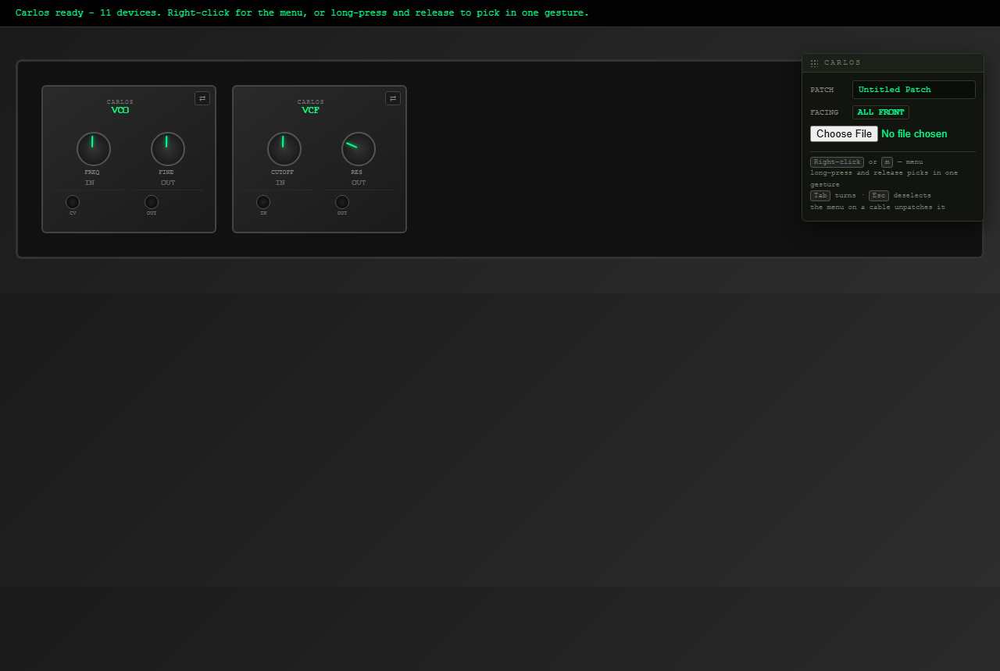
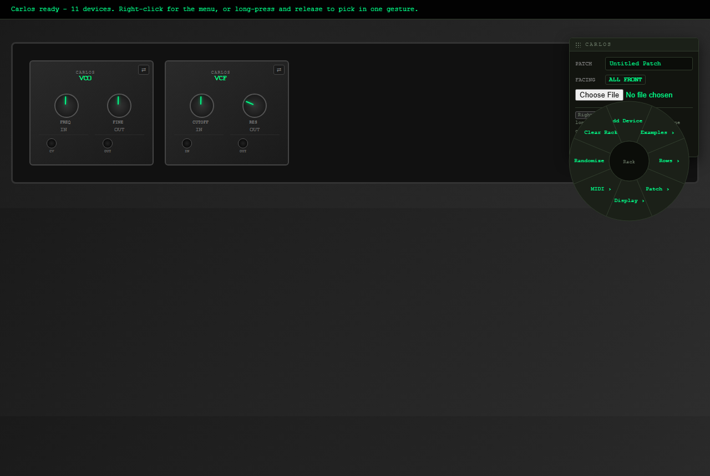
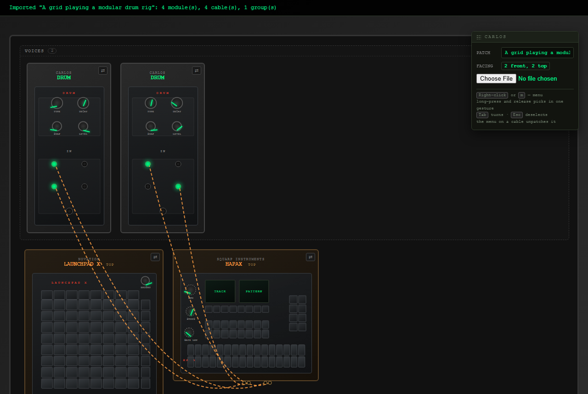
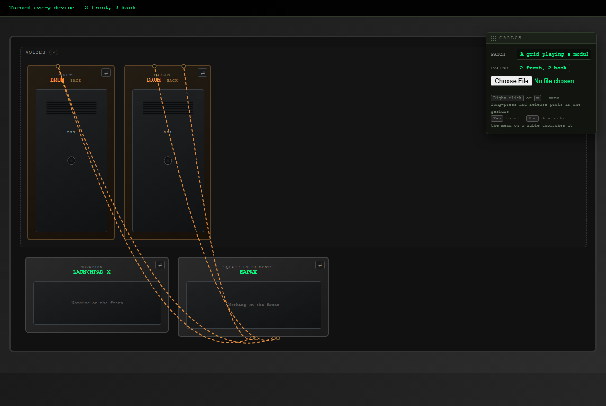

# 05 — In the browser

> **Runtime-bound: a server and a browser.** This page starts the real
> application on a port of its own and drives it in real Chromium. It does not
> skip when either is missing — it fails. A skip is not a pass, and a
> demonstration nobody can run is a claim.

Everything before this page asserts the model. This one asserts the screen, and
the pictures below it are byproducts of the same run: **taken from the render
those assertions were made against, recorded and never compared.** A test that
diffs images fails on a font and gets switched off, taking the assertions
sitting beside it. The regression protection is the assertions.

## Provisioning

```python
>>> from walkthrough.support import LiveApp, Shots, open_rack, open_menu, pick
>>> from playwright.sync_api import sync_playwright
>>> app = LiveApp().start()
>>> shots = Shots('05-in-the-browser')
>>> driver = sync_playwright().start()
>>> browser = driver.chromium.launch()

```

`LiveApp.start()` polls `/healthz` and raises `Unreachable` if it never
answers. A port of its own, not 8000: a developer's own server is usually up,
and measuring that one would test whatever code happened to be running.

## Boot

```python
>>> page = open_rack(app, browser)
>>> page.title()
'Carlos - Synth Patch Workspace'

```

The catalogue is fetched at startup, and the rack begins with the generic pair:

```python
>>> page.locator('.module').count()
2

```

**A browser JS error never reaches the server log.** The log is identical
whether the page works perfectly or throws on every keypress, which is why this
project could not previously claim the page worked at all. The console is
captured, and here it is:

```python
>>> page.errors
[]

```

The palette opens at its default corner, which is the top right — the first
thing here ever to check that against a real viewport rather than arithmetic:

```python
>>> palette = page.locator('#tool-palette').bounding_box()
>>> viewport = page.viewport_size
>>> round(viewport['width'] - (palette['x'] + palette['width']))
20
>>> round(palette['y'])
68

```

And the facing indicator reports the rack it is actually looking at:

```python
>>> page.locator('#view-indicator').inner_text()
'ALL FRONT'

```

> That assertion is why this page exists. It read `EMPTY` on a rack with two
> devices in it, for two sessions, because nothing refreshed it when a device
> was added — and every model-level test agreed with the model. The first run
> of this page found it.

```python
>>> shots.take(page, 'boot')
'05-in-the-browser-boot.png'

```



## The menu is a ring

Right-click anywhere on the rack. The ring holds at most eight, which the
resolver enforces rather than a reviewer:

```python
>>> rack = page.locator('#rack').bounding_box()
>>> spot = (int(rack['x'] + rack['width'] - 120), int(rack['y'] + rack['height'] - 40))
>>> open_menu(page, *spot)
>>> page.locator('.rad-wedge').count()
8

```

```python
>>> shots.take(page, 'menu')
'05-in-the-browser-menu.png'

```



`pick` moves the real pointer onto a wedge and releases, which is the gesture —
the menu resolves a position into a wedge and knows nothing about which element
was under the cursor.

```python
>>> pick(page, 'Examples')
>>> page.locator('.rad-wedge').count()
8

```

Eight categories, one ring. Devices are grouped by category and the overflow
would become a continuation submenu rather than a ninth wedge.

## Loading the drum rig

```python
>>> pick(page, 'controller')
>>> pick(page, 'Launchpad X')
>>> page.wait_for_timeout(800)
>>> page.locator('#status').inner_text()
'Imported "A grid playing a modular drum rig": 4 module(s), 4 cable(s), 1 group(s)'

```

Four devices, four cables, and the example asked for `irl`, so the rack is
drawn as laid out:

```python
>>> page.locator('body').get_attribute('data-display-mode')
'irl'
>>> page.locator('path.cable').count()
4

```

## The panels are drawn

This is the claim two sessions of work could not check: that the panel
vocabulary renders as panels rather than as a row of grey boxes.

The Launchpad X's grid, and the Hapax's two pad blocks, are real elements with
real boxes:

```python
>>> page.locator('.irl-pads .irl-cell').count()
112

```

Sixty-four of them are the Launchpad's, and the modules are addressed by the
ids the example gave them:

```python
>>> launchpad = page.locator('[data-module-id="grid"]')
>>> launchpad.locator('.irl-pads .irl-cell').count()
64

```

A device draws every side it has and lays out only the one it is showing, so
the panel to measure is the active face. A Launchpad X is 241mm square and the
face it opens on is its top — width by depth — so that panel is square too. That is the box doing its job: a
single per-device aspect would have drawn this face at 241 by 17.4.

```python
>>> panel = launchpad.locator('.face.active .irl-panel').bounding_box()
>>> round(panel['width'] / panel['height'], 1)
1.0

```

A device drawn as laid out is drawn near its real size relative to its
neighbours. A Launchpad X is 241mm across and a drum module is 40mm, so the
grid is the wider of the two on screen — by a compressed ratio, which is what
makes this a caricature rather than a scale drawing:

```python
>>> wide = launchpad.bounding_box()['width']
>>> narrow = page.locator('[data-module-id="kick"]').bounding_box()['width']
>>> wide > narrow
True
>>> 1 < wide / narrow < 6      # not to scale: really it is six times wider
True

```

```python
>>> shots.take(page, 'irl-drum-rig')
'05-in-the-browser-irl-drum-rig.png'

```



## Turning a device

`Tab` turns the whole rack; the indicator follows what is actually showing.

```python
>>> page.keyboard.press('Tab')
>>> page.wait_for_timeout(200)
>>> page.locator('#view-indicator').inner_text() != 'ALL FRONT'
True

```

Every cable is still drawn, with the ends that went out of sight anchored to
their device's outline rather than dropped:

```python
>>> page.locator('path.cable').count()
4

```

```python
>>> shots.take(page, 'turned')
'05-in-the-browser-turned.png'

```



## The palette moves

Drag it by its grip and it goes where you put it.

```python
>>> before = page.locator('#tool-palette').bounding_box()
>>> grip = page.locator('#tool-palette-grip').bounding_box()
>>> grab_x, grab_y = grip['x'] + 40, grip['y'] + 10
>>> page.mouse.move(grab_x, grab_y)
>>> page.mouse.down()
>>> page.mouse.move(grab_x - 260, grab_y + 220, steps=12)
>>> page.mouse.up()

```

It moves by what the hand moved, not to where the hand is — the grab offset is
kept, so the panel does not jump its own corner under the cursor:

```python
>>> after = page.locator('#tool-palette').bounding_box()
>>> round(before['x'] - after['x'])
260
>>> round(after['y'] - before['y'])
220

```

And it is remembered, so a reload brings it back where it was left:

```python
>>> _ = page.reload(wait_until='networkidle')
>>> _ = page.wait_for_selector('#tool-palette')
>>> reloaded = page.locator('#tool-palette').bounding_box()
>>> (round(reloaded['x']), round(reloaded['y'])) == (round(after['x']), round(after['y']))
True

```

## What was recorded

```python
>>> shots.recorded()
['05-in-the-browser-boot.png', '05-in-the-browser-menu.png',
 '05-in-the-browser-irl-drum-rig.png', '05-in-the-browser-turned.png']

```

Each of those was written by `Shots.take`, which asserts the file exists and is
not empty before returning its name. Fifteen lines that turn "somebody forgot"
into a red build.

## Nothing threw, the whole way through

```python
>>> page.errors
[]

```

```python
>>> browser.close()
>>> driver.stop()
>>> app.stop()

```

## What this page does not cover

Real MIDI hardware. The bindings are exercised through the synthetic source in
`02`-level tests and by the menu's own test-note action; a real port needs a
real device, and pretending otherwise would make the automated half less
credible rather than more.
